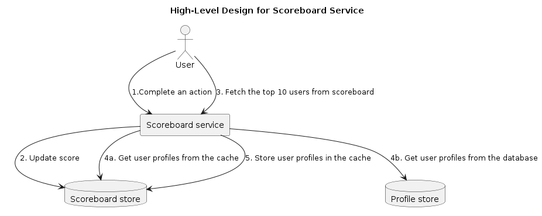
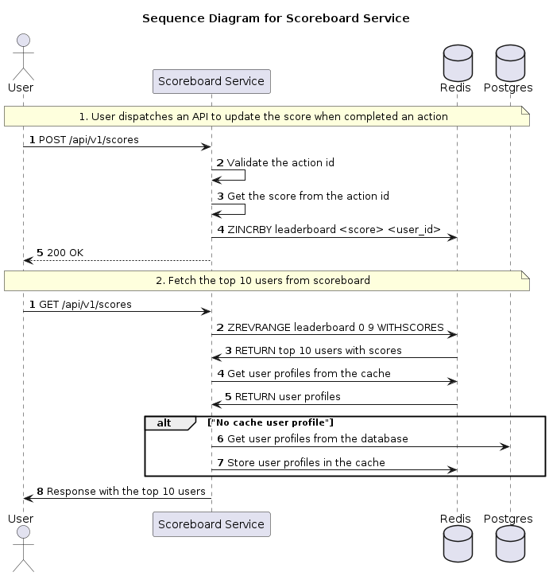

# Top 10 users' score scoreboard specification

## 1. Understand the requirements


### Functional requirements

- Display top 10 users on the scoreboard
- User can dispatch an API to update the score when completed an action

### Non-functional requriments

- Real-time update on scores
- Prevent malicious users from increasing scores without authorisation

## 2. High-level Design

### Architecture



1. When user completed an action, the client sends a request to scoreboard service.
2. The scoreboard service will validate to make sure action is valid and get the score based on specified action. Then update the user's score in the scoreboard store
3. A user makes a call to the scoreboard service directly to fetch scoreboard data
4. (a+b) The scoreboard service will get top scoreboard from scoreboard and user profile (in cache if exist)

### Sequence diagram



### API design


#### POST /api/v1/scores

Update user's score on the scoreboard when user completed an action. The action is a string that represents the action that user completed. We will define a list of actions that corresponds to the score that user will get when they completed the action.

```
POST /api/v1/scores
Content-Type: application/json
Authorization: Bearer <token>

{
  "actionId": "action_id"
}
```

Response:

```
HTTP/1.1 200 OK
Content-Type: application/json

{
  "score": 10
}

---

HTTP/1.1 401 Unauthorized
Content-Type: application/json

{
  "error": "Unauthorized"
}

---

HTTP/1.1 400 Bad Request
Content-Type: application/json

{
  "error": "Invalid action id"
}
```

#### GET /api/v1/scores

Get the top 10 users on the scoreboard.

```
GET /api/v1/scores
Content-Type: application/json
```

Response:

```
HTTP/1.1 200 OK
Content-Type: application/json

{
  "scores": [
    {
      "userId": "123",
      "score": 10
    }
  ]
}
```
